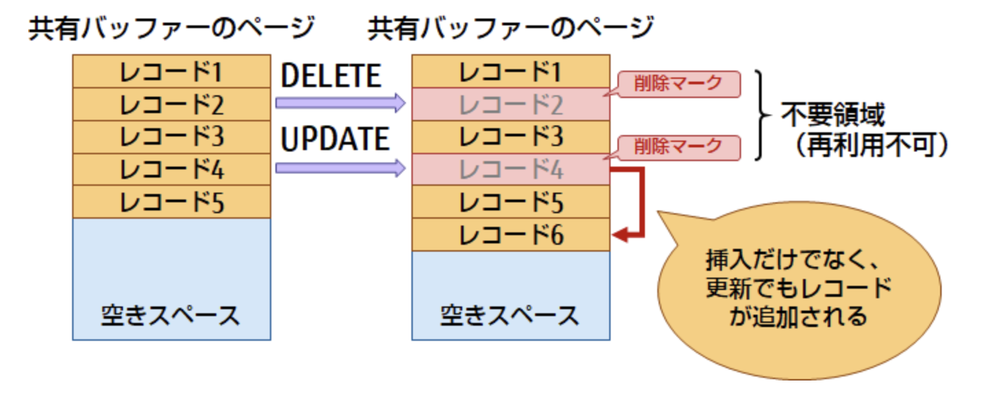
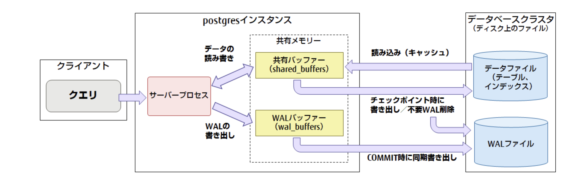

# [tochisuke docs](https://tochisuke221.github.io/)

## PostgreSQL のアーキテクチャ

### 背景

PostgreSQL のアーキテクチャを知らないと、スロークエリの実行計画の内容を読み解けないため基本的なアーキテクチャをまとめてみる。

### 全体像

まず基本的構成を知るには、下記の図がわかりやすい。

https://www.fujitsu.com/jp/products/software/resources/feature-stories/postgres/article-index/architecture-overview/

下記に重要な構成要素を一部抜粋する

#### サーバープロセス

クライアントとのセッションごとに作成され、バックエンドプロセスともいう。
発行された SQL の解析と実行を担い、その際にサーバープロセス単位で確保されたプロセスメモリーを使う。テーブルやインデックスのデータ更新は、共有メモリ上で行う

#### メモリ

メモリには、大きく分けて、共有メモリとプロセスメモリーの 2 つがある

**共有メモリ**

PostgreSQL 全体で確保されるメモリのことで、バックグランドプロセスおよびバックエンドプロセスのすべてから参照される。
共有メモリは下記のような領域に分けられる

- 共有バッファ（shared_buffer）
  - テーブルやインデックスのデータをキャッシュする
- WAL バッファ（wal_buffer）
  - ディスクに書き込まれていないトランザクションログをキャッシュする領域
- 空き領域マップ
  - Free Space Map ともいい、テーブル上の利用可能な領域を指し示す情報を扱う
  - バキューム処理時にトランザクションから全く参照されてない行を探して、空き領域として再利用可能にする。レコードの追加、更新時にはこの空き領域マップを参考に、空いている領域にレコードを挿入していく。
- ソートなしでレコードを取得する時に順番がバラバラなのはこれも一因らしい
- 可視性マップ
  - テーブルのデータが可視であるか否かを管理する情報を扱う領域
  - バキューム処理の高速化のため

**プロセスメモリ**

バックエンドプロセスごとに確保される作業メモリ領域
プロセスメモリは下記の領域に分けられる

- 作業メモリ（work_mem）

  - クエリ実行時に行われるソートやハッシュテーブルの操作のために使われる領域
  - 作業メモリ以上の大きな一時テーブルができると Disk Usage が発生し、著しいパフォーマンス劣化が認められる
  - また、この値が大きいとシステム全体のメモリを圧迫する可能性があるので設定には注意が必要
    - 最大でも「（物理メモリー - shared_buffers の値） ÷ max_connections の値」以下とする（[参照](https://www.fujitsu.com/jp/products/software/resources/feature-stories/postgres/article-index/database-tuning/)）

- メンテナンス用作業メモリ（maintenance_work_mem）
  - バキューム、インデックス作成、外部キー追加などのデーターベースメンテ時に使用する。
- 一時バッファ（tmp_buffer）
  - 一時テーブルアクセス時に用いられるメモリ領域

## 主なアーキテクチャ

PostgreSQLにおいて個人的に特徴的だと思うアーキテクチャについてもまとめておく

### 追記型アーキテクチャ

PostgreSQL では、追記型アーキテクチャーを採用していて、UPDATE 文などでテーブルやインデックスのレコードを更新する際には、元のデータに削除マークを付けて残しておき、更新後のレコードを追記する。また、DELETE 文でレコードを削除する場合も削除マークを付けて元のレコードを残す。

なお、削除マークが付けられたレコードは不要領域となり再利用ができない。
そのため、データの更新が多い運用の場合にデータファイルのサイズが増加することから、データファイルのサイズを見積もる際には、更新量に応じて、実際に扱うデータの量よりも多めに見積もっておく必要がある。

また追記型アーキテクチャに伴い、VACUUM（バキューム処理）が発生する。
これは、テーブルやインデックスのレコードの更新や削除によって発生した不要領域を再利用できるよう処理する。
通常、PostgreSQL では autovacuum という機構が、初期状態で自動で動作するよう設定されているが、更新頻度が高い場合には、不要領域の解消が間に合わず、データ量の肥大化につながることがある。

その場合、autovacuum の設定値の調整や、VACUUM FULL コマンドで不要領域を削除し、データ量の肥大化を抑えることを検討します。なお、VACUUM FULL コマンドは、テーブルに強いロックがかかる点と、処理に時間がかかる点を十分に考慮した上で利用する必要がある。

### データ更新とチェックポイント
PostgreSQLでは、更新時に共有バッファでキャッシュされたデータにアクセスするが、共有バッファー上で更新されたダーティーページはすぐにデータファイル（ディスク）への書き出しが行われない。

まず、トランザクションの更新ログ（WAL）をWALバッファーに格納し、COMMITのタイミングでWALファイルへ書き出す。
これはデータベースの更新処理の高速化と障害発生時のデータ補償を両立するためである。

実際にデータファイルへの書き出しは、定期的なチェックポイント処理が行われる際に行う。
その際に同時に不要なWALファイルも削除する。

### マルチプロセス
PostgreSQLはマルチプロセスタイプのアーキテクチャである。
（対象にMySQLはマルチスレッドである）
https://zenn.dev/farstep/articles/process-thread-difference

つまり、PostgreSQLのように接続ごとに子プロセスをforkするモデルなのに対して
MySQLはプロセス数は基本的に1、スレッド数でスケールする構成になっている。

そもそも、これら２つの設計思想が下記のように異なるため当然アーキテクチャも異なる

- MySQL
  - 高速に動作すること。複雑な処理や厳格な処理は積極的にサポートしない。
- PostgreSQL
  - 高機能、堅牢性

参考: https://scrapbox.io/knowledgeboxEngawa/PostgreSQL_%E3%83%9E%E3%83%AB%E3%83%81%E3%83%97%E3%83%AD%E3%82%BB%E3%82%B9%E3%81%AB%E3%81%A4%E3%81%84%E3%81%A6

参考; https://kinsta.com/jp/blog/postgresql-vs-mysql/?utm_source=chatgpt.com

---

[← ホームに戻る](../../)
