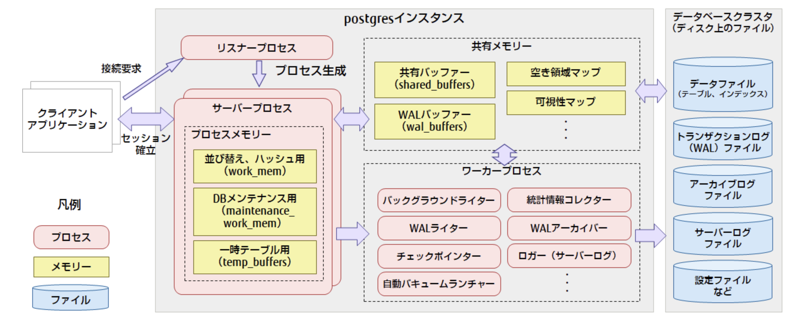

# [tochisuke docs](https://tochisuke221.github.io/)

## マテリアライズドビューについて
### 背景
ある処理に制約時間がある場合、発行される各SQLのパフォーマンス自体は悪くなくても、処理全体としての完了時間が要件を満たせないことがある。
このようなケースでは、単純なSQLのパフォーマンスチューニングだけでは改善が難しい。

そのため、処理の事前分割や中間結果のキャッシュといったアプローチが有効となる。
ここでは、そうした手法の代表例であるマテリアライズドビューについて調べる。

また、今回自分の仮説として「一時テーブルをうまく使えば、そのセッション内においてはパフォーマンス改善できるのではないか？」と考え、代表的なアプローチであるマテリアライズドビューと合わせて、テンポラリーテーブルの活用について整理する。


### マテリアライズドビューと一時テーブルについて
#### マテリアライズドビュー

##### 概要
マテリアライズドビューは、SQLクエリの結果を定期的に保存する事前計算ビューのことであり、あたかも通常のテーブルのように結果を保持する。
通常の「ビュー」では、SQL（SELECT文）を保持しているだけなのに対して、マテリアライズドビューはデータの実体を持っている。

また、主な通常のテーブルとの違いは。マテリアライズドビューを**直接更新できない事**である。

マテリアライズドビューを用いると、クエリ結果を保存して各クエリでスキャンされるデータ量を減らすことで、クエリに関連する処理時間と費用を削減できるものの、常に最新のデータを保持しているわけではないことに注意する必要がある。


##### メンテナンス
マテリアライズドビューでは、リフレッシュと呼ばれる管理操作が必要である。 
これは、元表（マスタ表）に加えられた変更をマテリアライズド ビューに反映（同期、メンテナンス）するものである。

PostgreSQLでは、[REFRESHコマンド](https://www.postgresql.jp/document/10/html/sql-refreshmaterializedview.html)が提供されている

```sql
REFRESH MATERIALIZED VIEW [ CONCURRENTLY ] name
```

Oracle等では、[高速REFRESH](http://docs.oracle.com/cd/E57425_01/121/DWHSG/refresh.htm#GUID-4FD1E4C6-B82F-4B13-880C-80187FA22AAF)というログベースに増分だけを更新するコマンドがあり、DBに負荷をかけずに更新することができるがPostgreSQLにおいてはそのようなコマンドが用意されておらず（※1）、再計算が走る。結果、リフレッシュ時には重いクエリ処理が走ってしまうのである。（そもそも重いクエリだから、マテリアライズドビューにしているので）


以上のことから、メンテナンス時には下記のことに気をつけた方が良さそう
- 更新頻度と時間
  - 重い再計算が日中、本番DBに負荷がかかることはなるべく避けておきたい。
- 参照ロック
  - `REFRESH MATERIALIZED VIEWS`コマンドの実行中は対象のビューはロックされる。そのため対象テーブルがどの程度読み書きされるものであるかや、それがユーザに影響するかは考慮しておいた方がよい
  - なお、[CONCURRENTLY](https://www.postgresql.jp/docs/17/sql-refreshmaterializedview.html#:~:text=%E3%83%91%E3%83%A9%E3%83%A1%E3%83%BC%E3%82%BF-,CONCURRENTLY,-%E3%81%9D%E3%81%AE%E3%83%9E%E3%83%86%E3%83%AA%E3%82%A2)オプションで回避することもできる
    - ただし、下記の制約がある
      - UNIQUEインデックスが必要
        - 通常のREFRESHでは古いデータを削除し、新しいデータを総入れ替えするが、CONCURRENCYオプションは、新しいテーブルの一時テーブルと現在の差分を検知し、差分更新を行うものである。そのため、マテビューに対して「すべての行を含み」「列名だけで構成された」「UNIQUE なインデックス」が少なくとも1つ必要です。式インデックスや WHERE 句付きの部分インデックスは NG。
        - 一時テーブルを作るため、work_memを多く使うことに注意が必要
      - すでにデータが存在している必要がある
        - REFRESH MATERIALIZED VIEW CONCURRENTLY は、空のマテビューには使えません。
      - 同時に1つしか実行できない
        - 同じマテビューに対して、複数の CONCURRENTLY リフレッシュは同時に走りません。つまり「同時に実行できるのは1プロセスまで」。

※1: 現在開発中らしい（https://www.sraoss.co.jp/tech-blog/pgsql/postgresql_ivm/）


##### ストレージについて
PostgreSQLはマテリアライズドビューに対して、クエリ結果をテーブルと同じような形で保存します。
そのため、保存先として以下のような構造が作られます
- データブロック（ヒープ）
- TOAST領域（大きいテキスト等の圧縮）
- インデックス（必要に応じて）

つまり、物理的なディスク領域を使うという点で、ふつうのテーブルと変わりません。

よって、マテビューが将来的に指数関数のように増加していくのであれば注意が必要


#### TEMPORARY TABLE（一時テーブル）
#### 概要
PostgreSQLのTEMPORARY TABLE(一時テーブル)は接続したセッションの間にしか生存できないテーブルのこと。
このテーブルは他のセッションからはアクセスすることができないテーブル。

作成後セッションが継続している間は通常のテーブルと同様に使えますが、セッションが終わると自動で削除されます。
セッション終了時だけでなく、トランザクション終了時に消したりも出来ます。

通常のテーブルであれば共有バッファを使用してテーブルを読み込むが、一時テーブルはサーバープロセスがもつ[tmp_buffer](https://www.postgresql.jp/docs/11/runtime-config-resource.html)で管理される




## マテリアライズドビューと一時テーブルの使い分け
一時テーブルは、temp_buffersの範囲内であれば、ファイルに書かれないまま動作するので早いが、この範囲を溢れた途端に遅くなる。
そのため。一般的にはマテライズドビューの方が扱いやすいと考える。

WITH句を用いる時以外は、あまり意図的に一時テーブルを使ってどうこうするというのは
なかなか難しそう。


## 参考
  - [PostgreSQLのドキュメント](https://www.postgresql.jp/docs/17/rules-materializedviews.html)
  - [BigQueryのドキュメント](https://cloud.google.com/bigquery/docs/materialized-views-intro?hl=ja)
  - [[PostgreSQL]複雑なクエリや集計処理に対する参照のパフォーマンスを向上させることのできるマテリアライズドビューについてまとめてみた](https://www.sraoss.co.jp/tech-blog/pgsql/postgresql_ivm/)
  - [TEMPORARY TABLE（一時テーブル）を探る](https://qiita.com/noborus/items/16ea90339a637d0f40f7)
