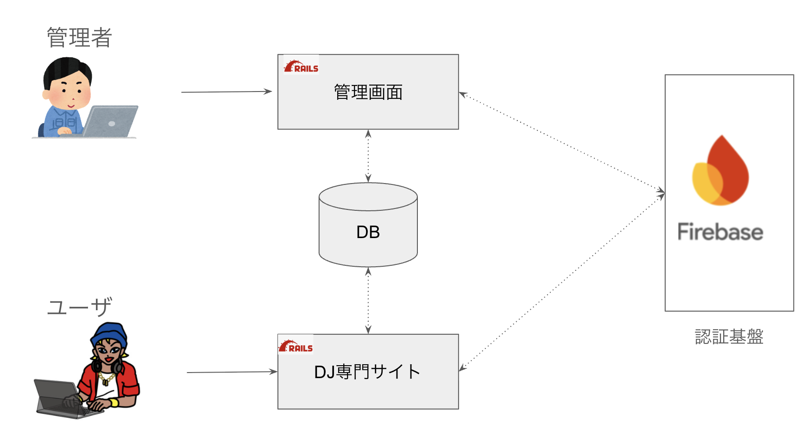
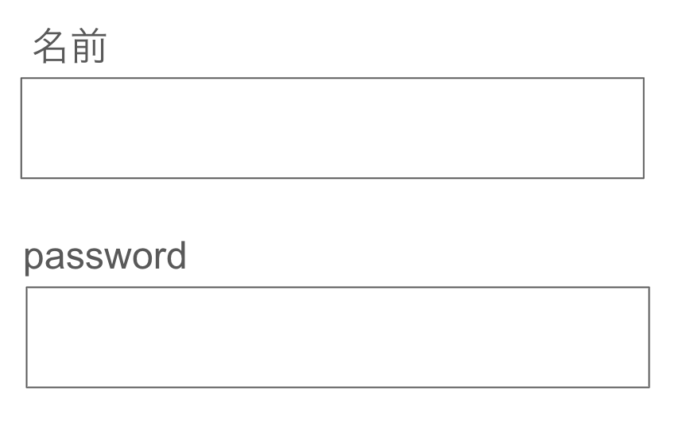

# [tochisuke docs](https://tochisuke221.github.io/)

## Punditを用いた認証情報の変更の認可処理

### 背景

Punditを用いて、「認証情報」の変更処理に対しての認可処理を行う実装についての、自身が混乱していたため整理する。

### 前提

とあるDJサイト専用サイトのシステムがあるとする


- ユーザーはFirebase認証基盤を使ってログインしている。
- Userモデルは firebase_uid を持ち、アプリケーション上の画面表示名などは name カラムで管理されている。
- 管理画面には「一般管理者」と「スーパ管理者」の2種類のロールが存在する。
- 管理画面では、ユーザーの name と Firebase 上の password を変更できるフォームがある。


ある日、DJ専用サイトのユーザーであるDJくんが「パスワードを忘れてしまった」と管理者に連絡。どうしてもパスワードを「it_show_time」にしたいとのことで、管理者が代わりにパスワードを再設定することになった。



今のままでは一般管理者もパスワードを変更できてしまうことに気づいたPdMの伊豆美沢くんは下記の要件を追加した。

- name は 一般管理者／スーパ管理者の両方が変更可能。
- password は スーパ管理者のみが変更可能。


つまり、「DJくんの認証情報の変更」を"スーパ管理者"だけが行えるように、適切にPunditで認可してあげる必要がある。

すでにUserPolicyなるファイルがあるが、、、
このような場合にPunditではどのような実装をすべきかについて考える


## UserPolicyを使うことに対する懸念

すでにあるUserPolicyを使ってみて実装を試みる。

```ruby
  class UserPolicy < ApplicationPolicy
    def update?
      return true if user.super_admin?

      return false if record.will_save_change_to_password?

      user.normal_admin?
    end
  end
end

```

しかし残念ながら、Userモデルはpassword属性をもっていない。
そのため、無理やり実装しようとするとUserクラスに仮想属性passwordを持たせ、Policy側でpasswordがあるかどうかで判断することとなる。

```ruby
  class User < ApplicationRecord
    attr_accessor :password
  end

  class UserPolicy < ApplicationPolicy
    def update?
      return true if user.super_admin?

      return false if record.password.present?

      user.normal_admin?
    end
  end

  # 呼び出し元
  def update
    @user = User.find(params[:id])
    @user.name = params[:user][:name]
    @user.password = params[:user][:password]

    authorize(::UserPolicy, :update?)

    update_password_firebase!(@user.firebase_id)
    @user.save!
  end
```

しかし、この実装には大きな問題点がある。
それは、Policyの認可判定を「password に値が存在するかどうか」で行っている点である。

たとえば、将来的にフォームの仕様が変更され、既存のパスワードがあらかじめ入力欄にセットされるようになった場合、意図せず user.password に値が入ることがある。
その結果、一般管理者が実際にはパスワードを変更していないにもかかわらず、変更したと見なされ、権限エラーが発生するおそれがある。

つまり、「値の有無」だけで変更の意図を判定することは不正確であり、仕様変更に対して脆弱な実装であると言える。
パスワードの変更を明示的に示すフラグや、旧値との差分による判定など、より意図に即した実装が求められる。

## なぜ問題点が発生するのか
本質的な原因は、UserPolicyにpassword属性の変更可否を委ねること自体が不適切と考えられる。

なぜなら、**Userモデルは認証情報を保持しないからだ。**

Punditは「誰が・どのリソースに・どんな操作を許可されるか」をPolicyクラスを通じて定義するアクセス制御ライブラリである。

Pundit の基本原則は、認可の責務をビジネスロジックから切り離すこと。
通常、ActiveRecordモデルごとに1対1でPolicyを定義し、そのモデルへの操作に関する権限を管理する。

この前提に立つと、UserPolicy はあくまでUser モデル（アプリケーション内のユーザー情報）に対する操作に責任を持つべきです。

今回のアーキテクチャでは、認証（ログインやパスワード変更）はFirebaseに委任されており、Railsアプリ側のUserモデルは「認証後のユーザー状態」を表すものにすぎない。
つまりUserモデルはアプリケーション固有のユーザー情報（表示名やプロフィールなど）を保持するが、
パスワードなどの認証情報は Firebase 側で管理されており、User モデルとは責務が分離されている。

よって、UserPolicyの責務は、アプリケーション内のUser リソースに対するアクセス制御に限定されるべきで
Firebaseの認証情報に関する操作は、Firebaseの写像となるモデル・Policyで管理されるべきと考えるのが自然かもしれない。

## どう実装するか

問題は、Userが管理すべきではない属性のアクセス制御をどこで行うべきかである。
自分としては2つの方法がある。

1. UserPolicyではなくFirebaseUserPolicyをつくる
2. UserPolicyにupdate_passwordメソッドをつくる

### 1. UserPolicyではなくFirebaseUserPolicyをつくる
Firebaseに対応したPolicy、FirebaseUserPolicyを作ってあげる。

```ruby
  class FirebaseUserPolicy < ApplicationPolicy
    def update?
      user.super_admin?
    end
  end
```

そうすると呼び出し元では、各処理に対してそれぞれ権限チェックができる。

```ruby

  # 呼び出し元
  def update
    @user = User.find(params[:id])
    @user.name = params[:user][:name]


    authorize(::FirebaseUserPolicy, :update?)
    update_password_firebase!(@user.firebase_id)

    authorize(::UserPolicy, :update?)
    @user.save!
  end
```

- メリット
  - Firebase に関する操作のみを扱う Policy として切り出すことで、UserPolicy に余計な責務を持たせずに済む。Punditの「1リソース＝1Policy」の思想にも沿っている。
  - 今後 Firebase の認証情報に関する操作（例：メール変更、MFA設定など）が増えても、Firebase 関連の認可はこの Policy に集約できる。将来的な拡張に強い
- デメリット
  - FirebaseUserPolicyはFirebaseUserモデルが存在しないにもかかわらず、リソースとして扱うことになるため、**「何に対する認可か」**が曖昧になりやすい。読み手が混乱する可能性がある。
  - プロジェクトメンバーが「FirebaseUserPolicyって何のために存在してるの？」という疑問を持ちやすく、設計意図をドキュメント化・共有する必要がある。

### 2. UserPolicyにupdate_passwordメソッドをつくる

UserPolicyに責務をもたせたくはないが、妥協点としてdef update_passwordを作ってもいいかもしれない。

```ruby
  class UserPolicy < ApplicationPolicy
    def update?
      user.super_admin? || user.normal_admin?
    end

    def update_password?
      user.super_admin?
    end
  end
```

こちらも呼び出し元ではそれぞれで権限チェックできる

```ruby

  # 呼び出し元
  def update
    @user = User.find(params[:id])
    @user.name = params[:user][:name]


    authorize(::UserPolicy, :update_password?)
    update_password_firebase!(@user.firebase_id)

    authorize(::UserPolicy, :update?)
    @user.save!
  end
```

- メリット
  - 新たにポリシークラスを追加する必要がなく、手軽に実装できる。既存のUserPolicyを拡張するだけで済む。
  - リソースが1つ（User）である前提なら、複数のリソースポリシーを分岐させる必要がない(メリットなのかわからんが)
- デメリット
  - Userモデルは認証情報（パスワード）を持たないにもかかわらず、その認可判断を担ってしまい、モデルとPolicyの責務がズレる。


## 最終的なジャッジ

> Pundit の基本原則は、認可の責務をビジネスロジックから切り離すこと。

この原則に立てば、本来であれば「認証情報の変更」という責務は User モデルの範囲外であり、別のドメインとして切り出すのが理想である。

しかし、現実にはすでに User モデル内に update_credential のような認証に関するロジックが存在しているケースも少なくない。
その場合、UserPolicy に認可処理を集約するのは妥協ではなく、現実的な選択肢とも言える。

この前提に基づくと、既存のUserモデルがどのように実装されているかで判断してもいいかもしれない。
すでにupdate_credentialのような認証に関するドメインロジックが実装されてしまっているなら、もはやUserPolicyに実装してしまう方法は十分にありだと思う。

また、「FirebaseUser が実体として存在しないのに Policy だけ分けるのは不自然では？」という指摘や、
「会員登録途中の状態は User と呼んでよいのか？」といった指摘も成立してしまうため、設計を厳密に分離するには他の部分への波及も避けられな
い。（https://kaigionrails.org/2024/talks/moro/）

したがって、現時点では 無理に構造を理想に寄せるより、UserPolicy に update_password? を追加する形で現実的に着地するのが妥当ではないかと考える。

理想と現実のバランスを見極めることが、設計においては何より重要である。


