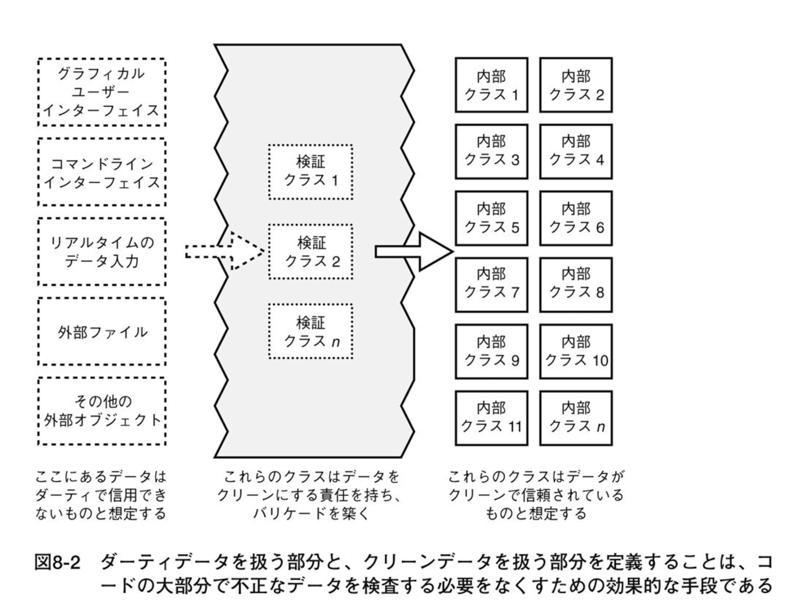

# [tochisuke docs](https://tochisuke221.github.io/)

## バリデーションについて

### 背景

フロントエンドでバリデーションがかかっているにも関わらず、バックエンドでも同様のバリデーションをするべきか否かについて気になったので調べてみた

## バリデーション
バリデーションとは、入力検証は、情報システムのワークフローに正しく形成されたデータのみが入力されることを確認するために実行される。
これにより、不正なデータがデータベースに残ったり、下流工程への誤作動を防ぐことができる。

入力検証の対象となるのは信頼できない可能性のある全てのソースからのデータになる。これはWebクライアントだけでなく、外部サービス（KintoneやLINE API）なども含む。

入力検証は、下記の順序で行うと良い。（CPUは計算コストが低い順に）

> オリジン: 正当な送信元から送られたデータなのか
>
> サイズ: データのサイズは適切か
>
> 字句的内容: データを構成している文字は正当な文字であり、正しくエンコードされているか
> 
> 構文: データは正しいフォーマットであるか
> 
> 意味: そのデータは意味的に正しいものなのか？
>
> 引用: セキュアバイデザイン P152

なお、OWASP（Open Web Application Security Project）では、特に構文レベルと意味レベルの検証が重要とされている。

構文の妥当性とは、データが想定された形式であることを意味する。
例えば、アプリケーションでユーザーが何らかの操作を実行するために4桁の「アカウントID」を選択できるようにすると仮定する。
アプリケーションは、ユーザーがSQLインジェクションのペイロードを入力していると想定し、ユーザーが入力したデータが正確に4桁の長さであり、数字のみで構成されていることを確認する必要がある。

意味的妥当性には、アプリケーションの機能とコンテキストにおいて許容可能な範囲内の入力のみを受け入れることが含まれる。
例えば、日付範囲を選択する場合、開始日は終了日よりも前である必要があるなど。

ざっくりまとめてしまえば、バリデーションは「形として正しいか」と「意味的に正しいか」を検証する必要がある。

## フロントエンドとサーバーサイドの検証

では、フロントエンドとサーバーサイドではどのような入力検証を行うべきか？
OWASPでは下記のように記されている

>入力検証は、アプリケーションの関数によってデータが処理される前に、サーバー側で実装する必要があります。クライアント側で実行されるJavaScriptベースの入力検証は、JavaScriptを無効化したりウェブプロキシを使用したりする攻撃者によって回避される可能性があるためです。UX向上のためにクライアント側のJavaScriptベースの検証と、セキュリティ向上のためにサーバー側の検証の両方を実装することが推奨されます。それぞれの長所を活かすことが推奨されます。

つまり、フロントエンドでは「UX向上（入力補助、即時エラー表示）」を目的に、必須項目や文字数制限、あるいはフォーマットチェックを行う。しかしこれはセキュリティ対策としては万全ではない（攻撃者によって、そのバリデーションはいくらでも無効にできるから）

一方、サーバーサイドではセキュリティ確保・データ整合性を目的に、業務ルールや権限チェック・整合性検証を行う。
また必要に応じてDB制約を用いる。

## サーバーサイドの検証とデータベース制約
ここで気になるのが、Railsのバリデーションではどこまで担保すべきなのか？

DB制約されているものは全てRailsのレイヤーでも検証を行うべきなのだろうか？

答えは「理想的にはYes」である。

前提として、モデルバリデーションとデータベース制約は「目的」が異なる。
データベース制約は「あらゆる入力に対する最終防衛線」的な立ち位置であり、厳格に入力値に対する検証を行う。
（ロック機構などが際たる例）
一方、モデルバリデーションはあくまで「ユーザフレンドリーな整合性チェック」のためのものである。
モデルバリデーションは[一意性検証の危険性](https://thoughtbot.com/blog/the-perils-of-uniqueness-validations?utm_source=chatgpt.com)でも述べられている通り、完全にデータ不整合を防ぐことができないためセキュリティの観点では危険を孕んでいる。
しかし、DBへアクセスすることなく、入力値の検証を高速に行える点でユーザフレンドリーである。

それぞれの目的が違うため、同じ制約はモデルとスキーマの両方に置くのが一般的にはベストプラクティスであるようだ

## 現実的な着地点
個人的には、データの正しさを壊せないもの（入力値の不正確さが事業の売上に影響するような値）に関しては、フロントエンドはもちろん、サーバーサイド・DBでの検証や制約を行うことで、堅牢な設計を求めると良い。

しかし、全てのフィールドにそのような実装をすることは工数コストに見合わない可能性がある。（例: 例えばニックネーム入力欄に過度な検証は必要ない）。そのようなケースにおいては、フロントエンドおよびDB制約のみでも十分と考える。（ただし、SQLインジェクションの対策などはサーバーサイドでも必要）

もちろん最終的にはチームの方針や運用体制に左右されるため、唯一の正解があるわけではない。
しかし、設計段階で「この制約が破られた場合に何が損なわれるのか」を明確にし、その影響度に応じて二重化の要否を判断することは極めて重要である。

## 参考
- [https://cheatsheetseries.owasp.org/cheatsheets/Input_Validation_Cheat_Sheet.html?utm_source=chatgpt.com](https://cheatsheetseries.owasp.org/cheatsheets/Input_Validation_Cheat_Sheet.html?utm_source=chatgpt.com)
- [https://thoughtbot.com/blog/validation-database-constraint-or-both?utm_source=chatgpt.com#when-validations-aren39t-enough&utm_source=chatgpt.com](https://thoughtbot.com/blog/validation-database-constraint-or-both?utm_source=chatgpt.com#when-validations-aren39t-enough&utm_source=chatgpt.com)

## 補足: 意味的妥当性とドメインロジック
上述した意味的妥当性のための検証は、ドメインロジックとして捉えるべきという考えもある。（セキュアバイデザインP166を参照）
