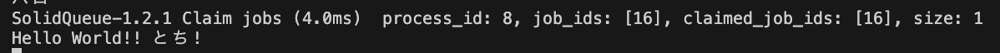
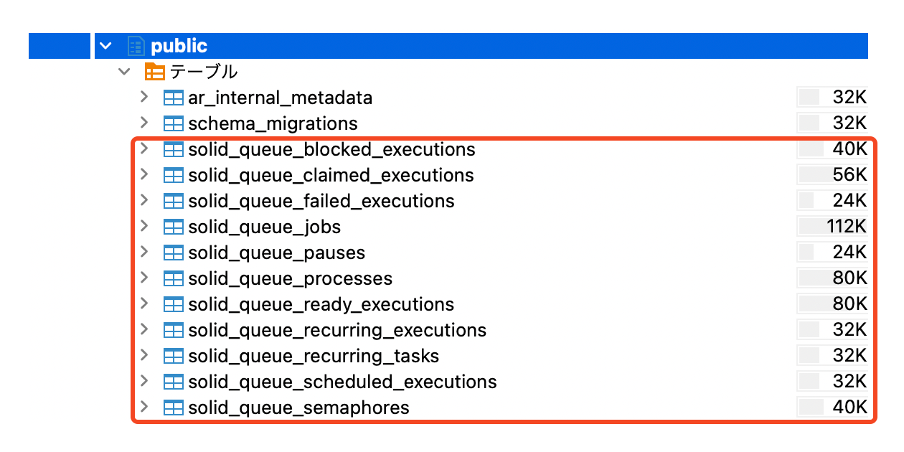

# [tochisuke docs](https://tochisuke221.github.io/)

## Rils8のSolid Queueを触ってみた

### 背景

ついに自チームでRails8になりそう。
今までDelayedJobにお世話になっていたが、非同期処理を頻繁に使う我々にとっては、やや物足りない印象の相棒だった。

そこでRails8からデフォルトとなったSolidQueueについてまとめてみる。
（というより、ただ遊んだときのメモである）

## Solid Queueとは
**概要**

Solid Queue は、Basecamp/37signals が開発した Rails向けの新しいジョブキューライブラリ。作者は Ruby on Rails を生み出した DHH（David Heinemeier Hansson）であり、Rails 7.1 からは Active Job の公式バックエンド候補 として登場した。

通常のジョブエンキューや処理に加えて、ジョブの延期、コンカレンシー制御、キューの一時停止、数値によるジョブ単位の優先度指定、キュー順序に基づいた優先度指定、バルクエンキュー（Active Jobのperform_all_laterで使われるenqueue_all）もサポートしている。


**歴史的背景**

Rails ではこれまでバックグラウンドジョブの実行手段として delayed_job や Sidekiq が広く使われてきたが、delayed_job は古い設計で、大量のジョブを処理するとテーブルが肥大化しパフォーマンスのボトルネックになりやすいという課題があった。そこで並列性とスケーラビリティに優れていたSidekiq が実運用で広く使われきた。しかし、Redis を必須とするため運用コストが増し、「Railsを動かすのにアプリDBとは別のミドルウェアが必要になる」というデメリットがあった。

このような背景から、「Railsが標準で備えるべきシンプルかつ強力なジョブキュー」を目指して開発されたのがSolidQueueである。


- 2009年頃
  - delayed_job が誕生し、「Rails × バックグラウンド処理」といえばこれ、という時代が続く。

- 2011年
  - Sidekiq が登場。Redis を活用して高性能・高並列を実現し、業務システムや大規模Railsアプリで主流になる。

- 2020年代前半
  - クラウドネイティブ環境では「Redisを別途運用するのがつらい」「ジョブ管理をRails公式に取り込んでほしい」という声が高まる。

- 2023年
  - Basecampが Solid Queue を公開。Rails 7.1 で Active Job のデフォルトバックエンド候補として組み込まれる。

**特徴**

SolidQueueの主な特徴を以下に示す

- 公式サポートの安定性
  - Rails本体と同じ作者がメンテしており、Active Job との親和性が非常に高い。
  - gem の更新が滞る心配がなく、Rails標準として長期的に使える。

- 外部依存の排除
  - Redisを使わずに、PostgreSQL/MySQLといった既存のアプリDBだけで完結できる。
  - プレビュー環境（Heroku環境）などでもRedisを立てなくとも利用可

- スケーラビリティの改善
  - delayed_job と同じくジョブはDBテーブルに保存されるが、ロック戦略やインデックス設計を改善し、大量ジョブにも耐えられる設計
  - 複数プロセス/スレッドでの並列実行を前提に設計されている。


## 実際に触ってみる

**とりあえず触ってみた**

「百聞は一見にしかず、百見は一考にしかず、百考は一行にしかず」と言いますし、とりあえずよくわかんないけど触ってみる。

[solid_queue](https://github.com/rails/solid_queue)のGithubのページみながら、何らかのプロジェクトに導入して、下記のJobを実行してみる。


```ruby
# app/jobs/hello_job.rb
class HelloJob < ApplicationJob
  queue_as :default
  def perform(name)
    puts "Hello World!! #{name}!"
  end
end
```

```bash
app(dev)> HelloJob.perform_later("とち")
  TRANSACTION (1.8ms)  BEGIN
  SolidQueue::Job Create (6.8ms)  INSERT INTO "solid_queue_jobs" ("queue_name", "class_name", "arguments", "priority", "active_job_id", "scheduled_at", "finished_at", "concurrency_key", "created_at", "updated_at") VALUES ($1, $2, $3, $4, $5, $6, $7, $8, $9, $10) RETURNING "id"  [["queue_name", "default"], ["class_name", "HelloJob"], ["arguments", "{\"job_class\":\"HelloJob\",\"job_id\":\"68c36a2a-0834-4d02-b380-df862276657e\",\"provider_job_id\":null,\"queue_name\":\"default\",\"priority\":null,\"arguments\":[\"とち\"],\"executions\":0,\"exception_executions\":{},\"locale\":\"en\",\"timezone\":\"UTC\",\"enqueued_at\":\"2025-08-24T10:04:46.061610837Z\",\"scheduled_at\":\"2025-08-24T10:04:46.061506629Z\"}"], ["priority", 0], ["active_job_id", "68c36a2a-0834-4d02-b380-df862276657e"], ["scheduled_at", "2025-08-24 10:04:46.061506"], ["finished_at", nil], ["concurrency_key", "[FILTERED]"], ["created_at", "2025-08-24 10:04:46.064175"], ["updated_at", "2025-08-24 10:04:46.064175"]]
  TRANSACTION (0.3ms)  SAVEPOINT active_record_1
  SolidQueue::Job Load (0.2ms)  SELECT "solid_queue_jobs".* FROM "solid_queue_jobs" WHERE "solid_queue_jobs"."id" = $1 LIMIT $2  [["id", 16], ["LIMIT", 1]]
  SolidQueue::ReadyExecution Create (0.3ms)  INSERT INTO "solid_queue_ready_executions" ("job_id", "queue_name", "priority", "created_at") VALUES ($1, $2, $3, $4) RETURNING "id"  [["job_id", 16], ["queue_name", "default"], ["priority", 0], ["created_at", "2025-08-24 10:04:46.087857"]]
  TRANSACTION (0.2ms)  RELEASE SAVEPOINT active_record_1
  TRANSACTION (8.0ms)  COMMIT
Enqueued HelloJob (Job ID: 68c36a2a-0834-4d02-b380-df862276657e) to SolidQueue(default) with arguments: "とち"
↳ (app):3:in '<main>'
=> 
#<HelloJob:0x0000ffff5f5346c0
 @_halted_callback_hook_called=nil,
 @arguments=["とち"],
 @exception_executions={},
 @executions=0,
 @job_id="68c36a2a-0834-4d02-b380-df862276657e",
 @priority=nil,
 @provider_job_id=16,
 @queue_name="default",
 @scheduled_at=Sun, 24 Aug 2025 10:04:46.061506629 UTC +00:00,
 @successfully_enqueued=true,
 @timezone="UTC">
app(dev)> 

```

ワーカーの標準出力にも表示された！いえーい


まあ、当たり前だけどJobそのものの動きは変わらない。


**気になったこと**

soli_queueを導入するともれなく、下記のようなテーブルが作成された。



後述するが、停止したjobや失敗したjobを保管しておくテーブルのようだ。
delayed_jobsテーブルを分割した感じ。

へー、かなり色々できそうだな。。ということでもう少し遊んでみる

## 基本機能を触る


**1. 遅延ジョブの実行**

```ruby
HelloJob.set(wait: 5.seconds).perform_later("こんにちは")
```

**2. リトライ処理**

リトライ処理ももちろんできる
Active Job には executions という実行回数カウンタがあるの初知り

```ruby
# app/jobs/flaky_job.rb
class FlakyJob < ApplicationJob
  retry_on StandardError, wait: 2.seconds, attempts: 3

  def perform(threshold = 3)
    @i ||= 0; @i += 1
    puts "==== 試行回数=#{@i} ===="

    raise "エラー" if @i < threshold

    puts "[FlakyJob] success"
  end
end

```

**3.キューの優先制御（複数キュー & 並び順）**

config/queue.ymlでキューの順序を設定できる


```yml
default: &default
  dispatchers:
    - polling_interval: 1
      batch_size: 500
  workers:
    - queues: [critical, bulk, default, low]
      threads: 3
      processes: <%= ENV.fetch("JOB_CONCURRENCY", 1) %>
      polling_interval: 0.1

development:
  <<: *default

test:
  <<: *default

production:
  <<: *default

```

また、priorityでも定義できる
どっちかというと優先度はこっちを使う

```ruby
HelloJob.set(priority: 10).perform_later

```

**4. キューの一時停止と再開**
下記のような形でキューを操作できる

```ruby
q = SolidQueue::Queue.find_by_name("bulk")  

q.pause
q.paused?       #=> true
q.resume
q.paused?       #=> false
```


**5. 定期実行**
config/recurring.yml に以下を追加して起動中の scheduler に拾わせることができる。

```yml
development:
  demo_recurring:
    class: HelloJob
    args: ["from_recurring"]
    schedule: every 30 seconds

```

再起動しないと反映しないので注意

## Solid Queueの基本構成

なんとなく色々触ってみてふーんって感じになったので、あらためてまとめてみる。

### 基本構成

基本構成は、dispatchers / workers / scheduler を Supervisorが束ねるという形になる。


| 役割             | 何をするか                                                        | 触る主な設定                                                            | スケール/調整の勘所                                                                                         |
| -------------- | ------------------------------------------------------------ | ----------------------------------------------------------------- | -------------------------------------------------------------------------------------------------- |
| **Dispatcher** | 未来時刻のジョブを、実行時刻になったら **Scheduled → Ready** に移す。並行実行制御のメンテも担当。 | `dispatchers:` の `polling_interval`, `batch_size`                 | 予約（`wait`/`wait_until` や recurring）が多いほど **台数/間隔を増やす**。遅延実行が遅れるなら `polling_interval` を短く。          |
| **Worker**     | **Ready** になったジョブを実際に取り出して実行。                                | `workers:` の `queues`, `threads`, `processes`, `polling_interval` | 処理が詰まる/遅い時は **threads/processes を増やす**。優先度は **`queues` の並び順が最優先**、同一キュー内は **数値 priority（小さいほど高）**。 |
| **Scheduler**  | `config/recurring.yml` に従い、**定期ジョブを投入**。                     | （明示設定は不要、Supervisor が起動）                                          | 基本は **1つで十分**。読み替え反映は **再起動**が確実。                                                                  |
| **Supervisor** | 全体の**起動・停止・監視**（Dispatcher/Worker/Scheduler を立ち上げ、ヘルスチェック）。  | `bin/jobs` もしくは `rake solid_queue:start` の実行そのもの                  | プロセスを増やす＝Supervisor が増えるイメージ。停止は **TERM=グレースフル / QUIT=即時**。                                        |


なので、全体のフローとしては、

```
[Scheduled Executions] --(Dispatcherの時刻到来検知)--> [Ready Executions] --(Workerが取得)--> perform

```

### テーブルの役割


| テーブル名                        | 役割 |
|-----------------------------------|------------------------------------------------------|
| solid_queue_blocked_executions    | ロックや同時実行制限により一時的にブロックされたジョブを保持 |
| solid_queue_claimed_executions    | Worker が「自分が処理する」と確保した実行中ジョブを管理 |
| solid_queue_failed_executions     | 失敗したジョブの履歴（リトライ上限超過・エラー終了） |
| solid_queue_jobs                  | ジョブ本体（クラス名・引数・優先度・状態など）を記録するメインテーブル |
| solid_queue_pauses                 | 特定キューの一時停止設定を管理（処理を止めたい時に使用） |
| solid_queue_processes             | Worker プロセスの情報（PID・ホスト・起動時刻）を管理 |
| solid_queue_ready_executions      | 実行可能になり、Worker が取り出せる状態のジョブを保持 |
| solid_queue_recurring_executions  | 定期実行タスクから展開された実行単位を保持 |
| solid_queue_recurring_tasks       | 定期実行タスクの定義（cron的な「毎時」「毎日」など） |
| solid_queue_scheduled_executions  | 遅延実行（`wait_until` や `wait` 付きジョブ）の待機行を管理 |
| solid_queue_semaphores            | セマフォによる排他制御・同時実行数制限を管理 |


## 

## 参考
https://guides.rubyonrails.org/active_job_basics.html#queue-order
