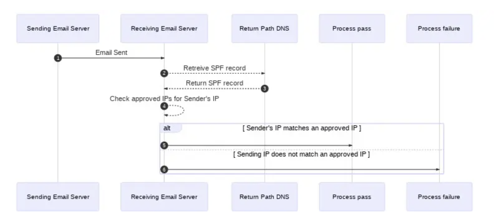
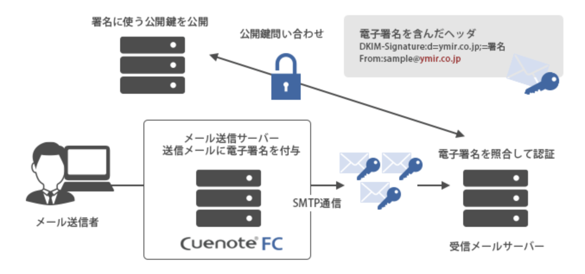
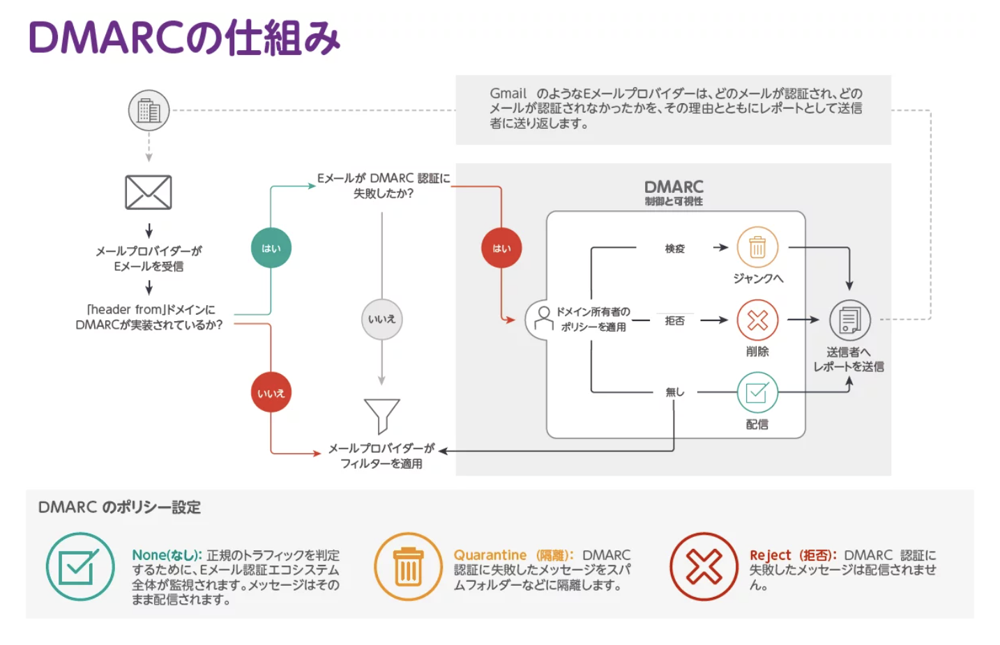

# [tochisuke docs](https://tochisuke221.github.io/)

## 【メール認証技術】SPFとDKIMとDMARCとBIMI

## 背景

メール認証機能を設定するにあたり、「SPF」「DKIM」「DMARC」というメール認証の基礎に触れたので
その用語とその仕組みについてまとめておく

## メール認証について

差出人を詐称して送られるメールをなりすましメールと言う。これを悪用すれば「大手ECサイトからのメールと見せかけて受信者を不正なWebサイトに誘導し、個人情報を抜き取る」といったこともできてしまう、

そこで、メール認証では受信したメールの情報が詐称されてないことを確認する必要がある。

## SPF

SPFとは「Sender Policy Framework」の略であり、電子メール認証のためのオープンスタンダード。

SPF は、メッセージの送信元IP アドレスがドメイン所有者によって電子メールの送信を承認されていることを確認する。
例えば、tochisuke.comというドメインを所有していて、IPアドレス127.0.0.1を所有するメールサーバーも保有しているとする。このよき、SPFレコードを使用して、「このIPアドレス(127.0.0.1)を、tochisuke.comというメールアドレスを使用してメールを送信できる唯一のIPとして指定できる。。

メールサーバーからメッセージを受信するとメッセージを配信したIPアドレスを確認できます。IPが127.0.0.1以外である場合はSPFチェックは失敗し、受信サーバーにメッセージが許可されていない送信元からのものであると判定される。




参考: [https://www.twilio.com/docs/sendgrid/ui/account-and-settings/spf-records](https://www.twilio.com/docs/sendgrid/ui/account-and-settings/spf-records)

## DKIM

DKIMとは「Domain Keys Identified Mail」の略であり、送信者がメッセージに「署名」を付与できる暗号技術です。

メールの受信者は、そのドメインを管理する送信者が責任を持って送信したかをチェックできる。
例えば、受信サーバがメールを受信したとする。送信者はメールサーバーに秘密鍵を配置し、メッセージから電子署名を生成する。受信サーバーは、「[DKIMセレクタ]._domainkey.[ドメイン名]」のTXTレコードに書かれた公開鍵を取得し、送られてきた電子署名を検証する。





なお、DKIMの認証は強力だが、以下は行わない。

- DKIM認証が失敗した場合にそのメールをどうするかは受信サーバ側の判断に委ねれる。
- DKIMは、送信者の正当性を保証しているわけではありません。例えDKIMが通っていたとしても、悪徳な業者がそのメールを送っている可能性は捨てきれない。（そもそも悪いやつが送っていたら元も子もない）
- DKIMはメールの再送を抑止しません。悪質なメールが受信者によって転送される可能性があり、転送された先で被害が発生することがある。

参考: [https://sendgrid.kke.co.jp/blog/?p=2044](https://sendgrid.kke.co.jp/blog/?p=2044)


## DMARC

DMARCとは「Domain-based Message Authentication Reporting and Conformance」の略で、SPFおよびDKIMの認証結果を基に、受信サーバがメールをどのように扱うべきかを送信ドメインが明示する仕組みである。これにより、送信ドメインは「自分のドメインを使ったなりすましメールにどう対処してほしいか」を統一的に宣言できる。


ドメインのDNSに設定されたDMARCポリシーに基づき、認証失敗メールをどのように処理するかを決定する。

- p=none → 特に制御せず、レポートのみ収集する
- p=quarantine → 迷惑メールフォルダに隔離する
- p=reject → 受信を拒否する



参考: [https://www.proofpoint.com/jp/threat-reference/dmarc](https://www.proofpoint.com/jp/threat-reference/dmarc)


一見DMARCはなくても良いような気がしてしまう。
しかし、DMARCは、SPFとDKIMの弱点を補う

SPFとDKIMの弱点は下記の通り
- SPFは、転送メールに弱く。転送サーバーのIPはSPFに登録されていないため、正規メールでもSPF認証に失敗することがある。
- DKIMは、認証失敗時の扱いを指示できないため、署名が無効でも受信サーバーによってはそのまま受信トレイに入ってしまう。

これらの問題点に対し、DMARCを用いて受信側の対応と統一し、レポート機能などによってなりすましの状況を可視化できる。


## BIMI

BIMIとは、「Brand Indicators for Message Identification」の略で、DMARCと呼ばれる認証が成功したメールに対し企業ロゴを付与し信頼性を高める技術。

BIMIによってメールに企業ロゴが付与されることで、そのメールがなりすましメールでないことがわかり、メールの信用性が高まる。


BIMIの設定にはDMARCが「p=quarantine」または「p=reject」の施行モードで設定されていることが必須。（つまり、厳格に管理されている必要がある）。その後、ロゴを用意し、DNSにBIMIレコードをTXTで登録し、ロゴURLを記載する。


```
default._bimi.example.com IN TXT "v=BIMI1; l=https://example.com/logo.svg; a=https://example.com/vmc.pem"
```

- l= → ロゴのURL
- a= → Verified Mark Certificate (VMC) の証明書URL（後述）

なお、ロゴは商標登録されている必要があり、Verified Mark Certificate (VMC) の証明書URLが必要となるため事前準備にはそれなりの時間を要する。

参考: [BIMI認証の事前準備の重要性。ブランドロゴ表示に1年かかった話](https://tech.asoview.co.jp/entry/2024/09/03/090359)

## 余談: SendGridでのSPF/DKIMの設定について

SendGridで「Domain Authentication」の設定をしいれば、 SPF/DKIMが独自ドメインで認証される。他のユーザからの影響を受けず、ドメインレピュテーションを独自に制御できるため、到達率の向上が期待される。

参考1: [https://sendgrid.kke.co.jp/blog/?p=10883](https://sendgrid.kke.co.jp/blog/?p=10883)
参考2: [https://www.twilio.com/docs/sendgrid/ui/sending-email/how-to-implement-dmarc?utm_source=chatgpt.com](https://www.twilio.com/docs/sendgrid/ui/sending-email/how-to-implement-dmarc?utm_source=chatgpt.com)
