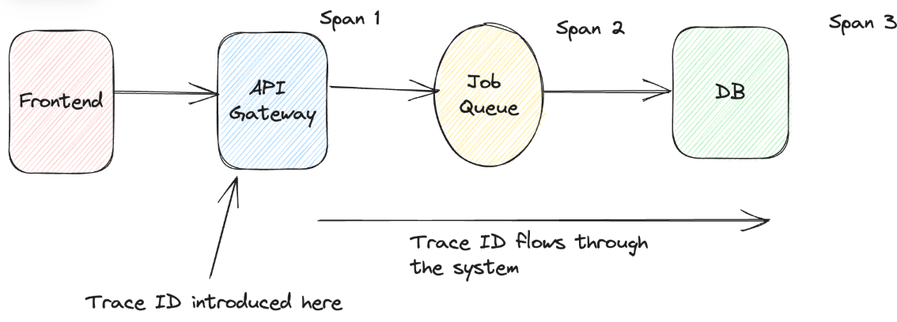

# [tochisuke docs](https://tochisuke221.github.io/)

## 可観測性とテレメトリに関する基礎（MELT）

## 背景

MELT（ログ、メトリック、トレース、イベント）の可観測性の柱となる様々なデータの種類が、
いつ使用すべきで、それぞれののメリデリは何かをまとめておく

## テレメトリーデータの役割

テレメトリデータでは、下記の情報を収集することで
システムの動作やアプリケーションのパフォーマンスなどを把握し、顧客体験への影響を回避できる。

テレメトリデータは、次のような問いに答える手がかりとなります。

- システムは正常に稼働しているか
- ダウンタイムを防ぐにはどうすべきか
- 障害発生時に迅速に対応・軽減できるか
- システムの挙動を正しく把握できているか
- 不具合の根本原因を突き止められるか
- マイクロサービスを跨いだ取引失敗を追跡できるか
- 停止やハードウェア障害との関連を明らかにできるか
- 異常や性能劣化の兆候を検出できるか

フトウェアシステムの可観測性において、テレメトリデータには4つの主要な種類がある。

- メトリクス(M)
- イベント(E)
- ログ(L)
- トレース(T)

これらをMELTと呼び、それぞれ異なる目的を持ち、システムの動作に関する独自の洞察を提供してくれる

## ログ

ログは、システムのある時点における動作を記述した文書を指す。
ログはどんな形式でも構わず、手軽に始められる。ゆえに、言語・フレームワーク・ライブラリ・ツールごとにログ形式が異なるため、サービス間やチーム間で統一的に扱うのが難しい。結果として、ツール選定やチームの運用フローに依存しやすい。

このような場合に構造化ログにしておいて、Datadogなどの監視ツールで効率的にログを管理すると良い

参考: [Railsアプリケーションのログを構造化してDatadogで活用するまで](https://product.plex.co.jp/entry/send-structured-logs-to-datadog-on-plex-job)

ログは「**何を探すか**」が分かっている場合にのみ有効で、ピンポイント調査には強い。
しかし「システム全体の健全性」を把握するには不向きで、生ログの目視確認では非効率。

また、ログは外部イベント（トラフィック急増、ジョブの増加、障害多発など）に応じてログが爆発的に増える。
そのため、適切なログレベルの設計やサンプリングが必要になる点に注意する。

つまりログは、トラブルシューティングには不可欠で詳細把握に強いが、標準化やスケーラビリティに課題がある。
また、健全性監視にはメトリクスやトレースと組み合わせて使うのが望ましい。

## メトリクス

メトリクスとは、システムの健全性を定量的に測定する指標を指す。
システムの健全性を把握するための**最も迅速**で低コストな方法**である。
これにより、ログを集約したデータであり、システムのパフォーマンスを俯瞰的に把握できる。
例えば、サービスの可用性、EC2インスタンスの空きCPU率、Redisデータベースのキャッシュヒット率、APIエンドポイントのレイテンシなどを知ることができる。

メトリクスの特徴として「ある瞬間の数値」を示すだけで、**どのサービスがどのサービスに影響を与えたのかといった「つながり」や「流れ」を表すことはできない**。この集約的な性質により、異常やパターンを見つけるために利用される。

## トレース

トレースとは、リクエストまたはワークフローがシステムのある部分から別の部分へと移動する際の、その経路の完全な記録のこと。

これは、リクエスト/アクションがすべてのホップを通過する際に標準のトレースIDを追加することで実現される。コンテキストが次の実行ホップに転送されるたびに、共有トレースIDが渡され、点と点を繋ぐのに役立ちます。このプロセスは分散トレースとも呼ばれる。

 

トレースデータはスパンで構成される。

- スパン: 分散システムにおける単一の作業単位であり、分散トレースの主要な構成要素。
- トレース: 分散トレースにおけるユーザーリクエストまたはトランザクションを表す。トレースは複数のスパンに分割されます。（例: リクエスト中のユーザー認証のための関数呼び出しは、スパンで表すことができる）

トレースは、2つのデータポイント間の方向性と関係性を提供する。各トレースは、呼び出されたAPI、所要時間、API実行の開始日と終了日によって特徴付けられる複数の作業単位で構成される。このよう情報から、サービスやコンポーネント全体のワークフローをエンドツーエンドで追跡でき、デバッグや根本原因分析に非常に有効となる。

ただし、システム全体の健全性を高いレベルで俯瞰する用途には向かない。
また、データが大量に生成され、爆発的に増える可能性がある。

## イベント

イベントとは、主にポッドの再起動、デプロイ、構成フラグの変更など、変更イベントを指す。
イベントはシステムの状態に外部的に影響を与え、**インシデントをメトリック、トレース、ログと相関させるのに役立つため、重要**。

観測可能性の観点から見ると、イベントには大きく分けて2つの使い方がある。

- 集計による洞察: イベントそのものではなく、発生頻度や傾向を追うことでシステムやビジネスの状態を把握する方法。（イベントの集合）
  - 例:「空港の過去1週間の1時間あたりの平均離陸数」を調べるのはこのケースにあたる。

- 個別イベントからの洞察: 単発の出来事自体が意味を持つ場合
  - 例:「あるチームが最後に優勝したのはいつか」といった問いは、単一のイベントデータに依存している。

イベントは「定義が難しいが非常に重要な観測データ」であり、システムの外部的な変化を正確に捉え、ログ・メトリクス・トレースと組み合わせることで真価を発揮するデータである。

## 比較

- ログ
  - 個々のイベントに関する詳細な情報を取得することに優れている。スタックトレース、リクエストペイロード、カスタムエラーメッセージといったコンテキストは、他のテレメトリでは省略されがちな情報として保存され、インシデント発生時、チームが何が起きたのかを再現するために最初に確認するのは、通常、ログです。

- メトリクス
  - 経時的な数値的な傾向を追跡するのに最適。システムの健全性とパフォーマンスを高レベルで把握できるため、アラートの設定、しきい値の監視、長期的なパターンの可視化が可能になる。メトリクスは収集と保存が軽量であるため、リアルタイムダッシュボードや履歴分析に最適。

- トレース
  - サービス間の点と点をつなぎ、リクエストがシステム内をどのように流れるかを明らかにする。パフォーマンスのボトルネックを明らかにし、依存関係を図示し、分散コンポーネント間のトランザクションのライフサイクル全体をチームが理解するのに役立つ。

 
 

|             | ログ                     | メトリクス                 | トレース                      |
| ------------- | ---------------------- | --------------------- | ------------------------- |
| **目的**        | 個別のイベントやメッセージを記録する     | 時間の経過に伴う数値の傾向を追跡する    | エンドツーエンドのリクエストフローをキャプチャする |
| **データ形式**     | テキスト（構造化／非構造化）         | 数値の時系列                | メタデータを含むスパンのツリー           |
| **粒度**        | 高い詳細度（単一イベントレベル）       | 集計された概要レベル            | 操作ごとの詳細を含むリクエストレベル        |
| **最適な用途**     | エラーのデバッグ、イベントの監査       | システム健全性の監視、アラート発動     | パフォーマンス診断、依存関係の理解         |
| **ストレージのニーズ** | 高い（詳細でボリュームが大きい）       | 低～中程度                 | サンプリングに応じて中～高             |
| **例題**        | どのエラーが発生したか？誰がトリガーしたか？ | 1秒あたりのリクエスト数やCPU使用率は？ | ワークフローのどこで遅延が発生したか？       |
| **強み**        | 豊富なコンテキストと詳細           | 効率的な監視と傾向分析           | リクエストの経路とタイミングを可視化        |
| **制限**        | 集計が難しくノイズが多い           | 個々の出来事の詳細に乏しい         | 保存と分析が複雑になりやすい            |

イベントは省略（基本の3つの柱の比較）

## まとめ

それぞれのテレメトリーデータは用途や目的が全く異なるため、ぞれぞれの文脈に応じて使い分けを行うようにしたい

## 参考

- [https://last9.io/blog/understanding-metrics-events-logs-traces-key-pillars-of-observability/?utm_source=chatgpt.com](https://last9.io/blog/understanding-metrics-events-logs-traces-key-pillars-of-observability/?utm_source=chatgpt.com)
- [https://speakerdeck.com/masayoshi/metorikusu-rogu-toresuwoumakushi-ifen-keteke-guan-ce-xing-wogao-meyou](https://speakerdeck.com/masayoshi/metorikusu-rogu-toresuwoumakushi-ifen-keteke-guan-ce-xing-wogao-meyou)
- [https://microsoft.github.io/code-with-engineering-playbook/observability/log-vs-metric-vs-trace/?utm_source=chatgpt.com](https://microsoft.github.io/code-with-engineering-playbook/observability/log-vs-metric-vs-trace/?utm_source=chatgpt.com)
