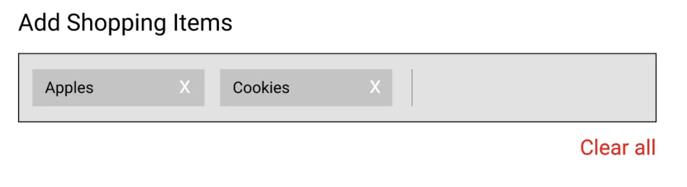

# [tochisuke docs](https://tochisuke221.github.io/)

## Reactコンポーネントのデザイン時に意識すべきこと


Reactコンポーネントは関数である。

コンポーネントは引数としていくつかのpropsを受け取り、最終的にDOMにレンダリングされる内容を記述するJSXを返すだけ。

それを念頭に考えると各コンポーネントが単独で果たす役割を明確にすることで、過度に複雑で多目的なコードを書くことを避けることができるはずである。
（単一の責任を持つ純粋なコンポーネントは、propsの数が少なくなり、結果としてテストが容易になり、理解しやすいコンポーネントになります。）

では、そのようなコンポーネントを作るために[どのようなアプローチをすると良いかを書いた記事](https://medium.com/%40ablamunits/making-good-component-design-decisions-in-react-2f4972e55d5)が、「たしかにね〜」となったので
簡単にまとめておく

### 1. コンポーネントの責務から考える

コンポーネントの責務とはなにか？

コンポーネントは基本的には「データ → UI表現」の関数と捉えられる。
つまり、ざっくりいえば「コンポーネントはあるデータ型の視覚化」をすることが責務である。

例えば、テキスト入力は、文字列型の表示が責務であり、チェックボックスもboolean値の表示が責務なのである。


### 2. コンポーネントを変化から考える

コンポーネントの責務は「特定のデータ型の視覚化」つまり「表示」である。
しかし、Webにおける「表示」は単なる表示ではなく、変化を伴う「表示」であることが大半である。

そのためコンポーネント設計では、コンポーネントに起きる「変化」に着目すると良い。

## 実例

1と2のアプローチを使って、下記のようなショッピングフォーム内で使用するコンポーネントを考える。




このコンポーネントの機能は4つ

- 項目の表示
- フィールドに項目を追加
- 既存の項目を削除
- すべてクリア

愚直な実装であれば下記のようなコードになる。（たまに見かける）

```javascript

const ShoppingForm = () {
  const [shoppingItems, setShoppingItems] = useState(['Apples', 'Cookies']);

  const onAddItem = (itemToAdd) => {
    setShoppingItems([...shoppingItems, itemToAdd]);
  };

  const onRemoveItem = (itemToRemove) => {
    const updatedItems = shoppingItems.filter(item => item !== itemToRemove);
    setShoppingItems(updatedItems);
  }

  const onClickClearAll = () => {
    setShoppingItems([]);
  }

  return (
    <InputWithLabels
      value={shoppingItems}
      onAddItem={onAddItem}
      onRemoveItem={onRemoveItem}
      onClickClearAll={onClickClearAll}
    />
  )
}
```

これは良くない設計である。

ShoppingFormが、コールバックプロパティのいずれかが呼び出されるたびに、そのデータを更新し、それを状態に永続化する必要となる。

つまり、InputWithLabelsが他の場所で再利用される場合、そのロジックを再実装する必要が生じる。
また、プロパティも肥大化している点も可読性が悪くなり、そのコンポーネントが何をしているか分かりにくくなる。

ここで、コンポーネントを「データ」と「変化」から捉え直して再設計してみる。

- ShoppingFormコンポーネントは、単にデータを表示するだけである。
- InputWithLabelsコンポーネントは、現在値に対して「追加」「削除」「全削除」の変化を起こすだけである

そうすると、、、

```ts
const ShoppingForm = () => {
  const [shoppingItems, setShoppingItems] = useState(['Apples', 'Cookies']);

  return (
    <InputWithLabels
      value={shoppingItems}
      onChange={setShoppingItems}
    />
  )
}

const InputWithLabels = (props) =  {
  const onAddItem = (itemToAdd) => {
    props.onChange([...shoppingItems, itemToAdd]);
  };

  const onRemoveItem = (itemToRemove) => {
    const updatedItems = shoppingItems.filter(item => item !== itemToRemove);
    props.onChange(updatedItems);
  }

  const onClickClearAll = () => {
    props.onChange([])
  }

  // いい感じに実装する
  return (
    <div>
      {props.value.map((label) => renderLabel(label))}
    </div>
  )
}
```

このようにすると、ShoppingFormコンポーネントは、実装の詳細（値がどのように変更されるか）を意識する必要がなくなり、責務に集中できる。

また、InputWithLabelsコンポーネントは、何を表示するかを意識する必要がなくなり、変化に対しての責務だけに集中できる（再利用性もあがる）。

結果として、「データ構造と変化」を明確化できコンポーネントが表現するべき 値（データ構造） がはっきりする。
同時に、その値が時間とともにどう 変化（追加・削除・更新など） するかを明示できる。
結果として「このコンポーネントは何を持ち、どう振る舞うか」が一目で理解できるようになった、

また、コンポーネントが「入力値」と「変更通知」という2本柱に従うため、状態の流れが単純化され
可読性も高まるメリットも享受できる

## 補足

ReactHookFormなども「表示」と「変化」を分ける設計となっている
参考: [RHF: Controller](https://react-hook-form.com/docs/usecontroller/controller?utm_source=chatgpt.com)

