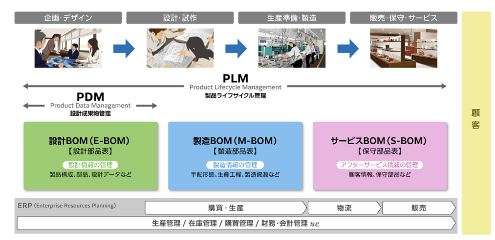
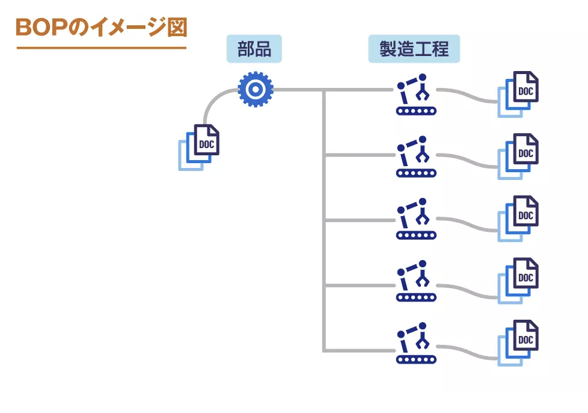

# [tochisuke docs](https://tochisuke221.github.io/)

## PLM・BOMの基本知識（用語理解）

### PLM

PLMとは ProductLifecycle Managementの略。日本ではライフサイクル管理と言われることが多い。

- PLM: 製品の技術情報やライフサイクルにわたって管理し、その製品や事業価値を最大化する経営手法
- PLMシステム: 経営手法であるPLMの業務を効率的・安定的に運用するための支援システム
- PLMソフトウェア: 市販されているPLMパッケージソフトウェアであり、企業向けの設定やアドオンが可能である。

PLMシステムの機能構成の代表例としては、ドキュメント管理、部品管理、BOM管理、設計変更管理、工程管理などが挙げられる。

### BOM 
BOMとは、Bill of Materialsの略。部品表と呼ばれることが多い。

商品企画や見積もり、設計、生産管理、購買、製造、保守など様々な業務シーンで利用される製品構成を表現するマスター情報である。

BOMの精度が低いと、業務が混乱し非効率になる。
そのため、BOMの精度を上げることが、PLMやBOMの業務設計システム構築の鍵となる

代表的なBOMは３種類

- E-BOM: Engineering BOMの略で、設計BOMや技術BOMとも呼ばれる、ドキュメントや図面を含めた設計情報はE-BOMを中核として管理される。
- M-BON: Manufacturing BOMの略で、生産BOM・製造BOMとも呼ばれる。生産用のマスターで工場の生産管理・工程設計の各部門などが共同でメンテする。E-BOMを元に作成され、生産都合による中間品や工程の追加などの構成の組み替え、自社調達不用品の削除などが行われる。
- S-BOM: サービス用のBOM、保守BOMと呼ばれる。量産製品におけるS-BOMではアフターパーツとして提供可能な部品で構成されるので、提供不可の部品は削除する

### BOP

BOPは、Bill of Processの略で、製品の組み立てや加工をするための部品ごとの手順を表したものです。製品を構成する部品を表にしたものをBOM（Bill of Materials）とうが、BOPはこれに、工程名、工順、製造条件、作業時間、工程図などを統合した概念。

BOPは、製品を製造するための工程と、それを構成する情報を管理するための統合されたシステム。製造のための管理システムには、図面などの技術情報を紐づけて管理するPLM (Product Lifecycle Management)があるが、、BOPはこれと連携して製品の生産にかかわる多くの情報を一元管理する

BOMがなければ、BOPに記載された手順通りに作業を進めるための部品が手元にないという事態が発生し、逆にBOPがなければ、BOMに記載された部品をどのように組み合わせて製品を完成させるかがわからず、生産が滞ってしまう。

## 参考
https://www.techs-s.com/media/show/7#BOM-2

